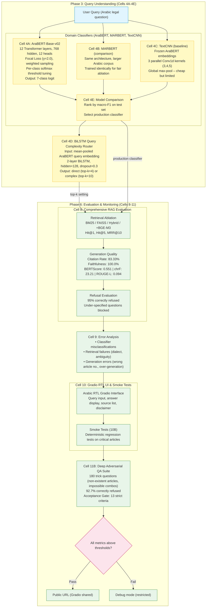

```mermaid
flowchart TD
    %% ============================================================================
    %% PHASE 3: QUERY UNDERSTANDING (Cells 4A‑4E)
    %% ============================================================================
    subgraph phase3["Phase 3: Query Understanding (Cells 4A‑4E)"]
        direction TB
        query["User Query (Arabic legal question)"]
        
        subgraph classifiers["Domain Classifiers (AraBERT, MARBERT, TextCNN)"]
            arabert["Cell 4A: AraBERT-Base-v02<br/>12 Transformer layers, 768 hidden, 12 heads<br/>Focal Loss (γ=2.0), weighted sampling<br/>Per‑class softmax threshold tuning<br/>Output: 7‑class logit"]
            marbert["Cell 4B: MARBERT (comparison)<br/>Same architecture, larger Arabic corpus<br/>Trained identically for fair ablation"]
            textcnn["Cell 4C: TextCNN (baseline)<br/>Frozen AraBERT embeddings<br/>3 parallel Conv1d kernels (3,4,5)<br/>Global max‑pool – cheap but limited"]
            comparison["Cell 4E: Model Comparison<br/>Rank by macro‑F1 on test set<br/>Select production classifier"]
        end
        
        router["Cell 4D: BiLSTM Query Complexity Router<br/>Input: mean‑pooled AraBERT query embedding<br/>2‑layer BiLSTM, hidden=128, dropout=0.3<br/>Output: direct (top‑k=4) or complex (top‑k=10)"]
        
        query --> arabert
        query --> marbert
        query --> textcnn
        arabert --> comparison
        marbert --> comparison
        textcnn --> comparison
        comparison --> router
    end

    %% ============================================================================
    %% PHASE 6: EVALUATION & MONITORING (Cells 8‑11)
    %% ============================================================================
    subgraph phase6["Phase 6: Evaluation & Monitoring (Cells 8‑11)"]
        direction TB
        
        subgraph cell8["Cell 8: Comprehensive RAG Evaluation"]
            retrieval_abl["Retrieval Ablation<br/>BM25 / FAISS / Hybrid / +BGE‑M3<br/>Hit@1, Hit@5, MRR@10"]
            gen_quality["Generation Quality<br/>Citation Rate: 83.33%<br/>Faithfulness: 100.0%<br/>BERTScore: 0.551 | chrF: 23.21 | ROUGE‑L: 0.094"]
            refusal_eval["Refusal Evaluation<br/>95% correctly refused<br/>Under‑specified questions blocked"]
        end
        
        cell9["Cell 9: Error Analysis<br/>• Classifier misclassifications<br/>• Retrieval failures (dialect, ambiguity)<br/>• Generation errors (wrong article no., over‑generation)"]
        
        subgraph cell10["Cell 10: Gradio RTL UI & Smoke Tests"]
            gradio_ui["Arabic RTL Gradio Interface<br/>Query input, answer display, source list, disclaimer"]
            smoke["Smoke Tests (10B)<br/>Deterministic regression tests on critical articles"]
        end
        
        cell11b["Cell 11B: Deep Adversarial QA Suite<br/>180 trick questions (non‑existent articles, impossible combos)<br/>92.7% correctly refused<br/>Acceptance Gate: 13 strict criteria"]
        acceptance{"All metrics above thresholds?"}
        deploy["Public URL (Gradio shared)"]
        debug["Debug mode (restricted)"]
        
        retrieval_abl --> gen_quality
        gen_quality --> refusal_eval
        refusal_eval --> cell9
        cell9 --> gradio_ui --> smoke --> cell11b --> acceptance
        acceptance -- Pass --> deploy
        acceptance -- Fail --> debug
    end

    %% ============================================================================
    %% CROSS‑PHASE FLOW
    %% ============================================================================
    router -->|top‑k setting| retrieval_abl
    comparison -->|production classifier| retrieval_abl

    %% ============================================================================
    %% STYLES
    %% ============================================================================
    classDef queryStyle fill:#e1f5fe,stroke:#0288d1
    classDef modelStyle fill:#fff9c4,stroke:#fbc02d
    classDef decisionStyle fill:#f3e5f5,stroke:#8e24aa
    classDef evalStyle fill:#e8f5e9,stroke:#388e3c
    classDef gateStyle fill:#fce4ec,stroke:#c2185b

    class query,query queryStyle
    class arabert,marbert,textcnn,comparison,router modelStyle
    class retrieval_abl,gen_quality,refusal_eval,cell9,gradio_ui,smoke,cell11b,deploy,debug evalStyle
    class acceptance gateStyle
```