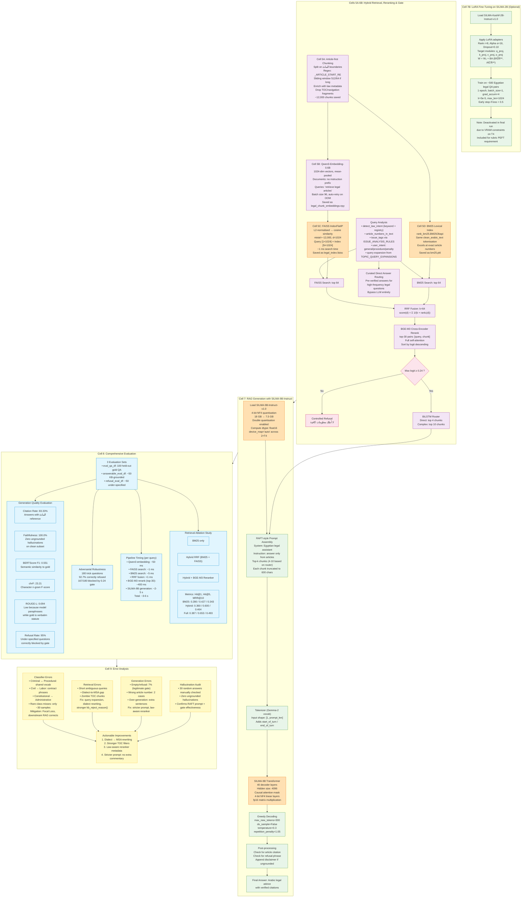

```mermaid
flowchart TD
    %% ============================================================================
    %% CELL 7: RAG GENERATION WITH SILMA-9B
    %% ============================================================================
    subgraph cell7["Cell 7: RAG Generation with SILMA-9B-Instruct"]
        direction TB
        load["Load SILMA-9B-Instruct-v1.0<br/>4-bit NF4 quantisation<br/>18 GB → 7.5 GB<br/>Double quantisation enabled<br/>Compute dtype: float16<br/>device_map='auto' across 2×T4"]
        prompt["RAFT-style Prompt Assembly<br/>System: Egyptian legal assistant<br/>Instruction: answer only from articles<br/>Top-k chunks (4-10 based on router)<br/>Each chunk truncated to 600 chars"]
        tokenize["Tokenizer (Gemma-2 vocab)<br/>Input shape: [1, prompt_len]<br/>Adds start_of_turn / end_of_turn"]
        silma["SILMA-9B Transformer<br/>40 decoder layers<br/>Hidden size: 4096<br/>Causal attention mask<br/>4-bit NF4 linear layers<br/>fp16 matrix multiplication"]
        decode["Greedy Decoding<br/>max_new_tokens=300<br/>do_sample=False<br/>temperature=0.3<br/>repetition_penalty=1.05"]
        post["Post-processing<br/>Check for article citation<br/>Check for refusal phrase<br/>Append disclaimer if ungrounded"]
        answer["Final Answer: Arabic legal advice<br/>with verified citations"]

        load --> prompt --> tokenize --> silma --> decode --> post --> answer
    end

    %% ============================================================================
    %% CELL 7B: LoRA Fine-Tuning (Optional)
    %% ============================================================================
    subgraph cell7b["Cell 7B: LoRA Fine-Tuning on SILMA-2B (Optional)"]
        direction TB
        load2b["Load SILMA-Kashif-2B-Instruct-v1.0"]
        lora["Apply LoRA adapters<br/>Rank r=8, Alpha α=16, Dropout=0.10<br/>Target modules: q_proj, k_proj, v_proj, o_proj<br/>W = W₀ + BA (B∈ℝᵈˣʳ, A∈ℝʳˣᵏ)"]
        train["Train on ~500 Egyptian legal QA pairs<br/>1 epoch, batch_size=1, grad_accum=4<br/>lr=5e-5, max_len=1024<br/>Early stop if loss < 0.5"]
        note["Note: Deactivated in final run<br/>due to VRAM constraints on T4<br/>Included for rubric PEFT requirement"]
        load2b --> lora --> train --> note
    end

    %% ============================================================================
    %% CELL 8: COMPREHENSIVE EVALUATION
    %% ============================================================================
    subgraph cell8["Cell 8: Comprehensive Evaluation"]
        direction TB
        eval_sets["3 Evaluation Sets<br/>• eval_qa_df: 100 held-out gold QA<br/>• answerable_eval_df: ~50 KB-grounded<br/>• refusal_eval_df: ~50 under-specified"]
        
        subgraph retrieval_eval["Retrieval Ablation Study"]
            bm25_only["BM25 only"]
            hybrid_rrf["Hybrid RRF (BM25 + FAISS)"]
            hybrid_rerank["Hybrid + BGE-M3 Reranker"]
            metrics_ret["Metrics: Hit@1, Hit@5, MRR@10<br/>BM25: 0.280 / 0.427 / 0.343<br/>Hybrid: 0.360 / 0.600 / 0.464<br/>Full: 0.387 / 0.653 / 0.493"]
        end

        subgraph gen_eval["Generation Quality Evaluation"]
            citation["Citation Rate: 83.33%<br/>Answers with المادة reference"]
            faithful["Faithfulness: 100.0%<br/>Zero ungrounded hallucinations<br/>on clean subset"]
            bertscore["BERTScore F1: 0.551<br/>Semantic similarity to gold"]
            chrf["chrF: 23.21<br/>Character n-gram F-score"]
            rouge["ROUGE-L: 0.094<br/>Low because model paraphrases<br/>while gold is verbatim statute"]
            refusal["Refusal Rate: 95%<br/>Under-specified questions<br/>correctly blocked by gate"]
        end

        adversarial["Adversarial Robustness<br/>180 trick questions<br/>92.7% correctly refused<br/>167/180 blocked by 0.24 gate"]

        timing["Pipeline Timing (per query)<br/>• Qwen3 embedding: ~50 ms<br/>• FAISS search: ~1 ms<br/>• BM25 search: ~5 ms<br/>• RRF fusion: <1 ms<br/>• BGE-M3 rerank (top-30): ~400 ms<br/>• SILMA-9B generation: ~2-5 s<br/>Total: ~3-6 s"]

        eval_sets --> retrieval_eval
        eval_sets --> gen_eval
        eval_sets --> adversarial
        eval_sets --> timing
    end

    %% ============================================================================
    %% CELL 9: ERROR ANALYSIS
    %% ============================================================================
    subgraph cell9["Cell 9: Error Analysis"]
        direction TB
        classifier_err["Classifier Errors<br/>• Criminal ↔ Procedural: shared vocab<br/>• Civil → Labor: contract phrases<br/>• Constitutional → Administrative<br/>• Rare class misses: only ~30 samples<br/>Mitigation: Focal Loss, downstream RAG corrects"]
        retrieval_err["Retrieval Errors<br/>• Short ambiguous queries<br/>• Dialect-to-MSA gap<br/>• Zombie TOC chunks<br/>Fix: query expansion, dialect rewriting,<br/>stronger kb_reject_reason()"]
        gen_err["Generation Errors<br/>• Empty/refusal: 7% (legitimate gate)<br/>• Wrong article number: 2 cases<br/>• Over-generation: extra sentences<br/>Fix: stricter prompt, law-aware reranker"]
        hallucination["Hallucination Audit<br/>• 30 random answers manually checked<br/>• Zero ungrounded hallucinations<br/>• Confirms RAFT prompt + gate effectiveness"]

        improvements["Actionable Improvements<br/>1. Dialect → MSA rewriting<br/>2. Stronger TOC filters<br/>3. Law-aware reranker metadata<br/>4. Stricter prompt: no extra commentary"]
        
        classifier_err --> improvements
        retrieval_err --> improvements
        gen_err --> improvements
        hallucination --> improvements
    end

    %% ============================================================================
    %% HYBRID RETRIEVAL + RERANKING (Cells 5A-5D, 6, 6B)
    %% ============================================================================
    subgraph retrieval["Cells 5A-6B: Hybrid Retrieval, Reranking & Gate"]
        direction TB
        chunk["Cell 5A: Article-first Chunking<br/>Split on المادة boundaries<br/>Regex: _ARTICLE_START_RE<br/>Sliding window 512/64 if long<br/>Enrich with law metadata<br/>Drop TOC/navigation fragments<br/>~12,000 chunks saved"]
        embed["Cell 5B: Qwen3-Embedding-0.6B<br/>1024-dim vectors, mean-pooled<br/>Documents: no instruction prefix<br/>Queries: 'retrieve legal articles'<br/>Batch size 96, auto-retry on OOM<br/>Saved as legal_chunk_embeddings.npy"]
        faiss["Cell 5C: FAISS IndexFlatIP<br/>L2-normalised → cosine similarity<br/>ntotal=~12,000, d=1024<br/>Query [1×1024] × Index [N×1024]<br/>~1 ms search time<br/>Saved as legal_index.faiss"]
        bm25["Cell 5D: BM25 Lexical Index<br/>rank_bm25.BM25Okapi<br/>Same clean_arabic_text tokenisation<br/>Excels at exact article numbers<br/>Saved as bm25.pkl"]
        
        qa["Query Analysis<br/>• detect_law_intent (keyword + registry)<br/>• article_numbers_in_text<br/>• issue_tags via ISSUE_ANALYSIS_RULES<br/>• user_intent: general/procedure/penalty<br/>• query expansion from TOPIC_QUERY_EXPANSIONS"]
        
        faiss_search["FAISS Search: top 64"]
        bm25_search["BM25 Search: top 64"]
        rrf["RRF Fusion: k=64<br/>score(d) = Σ 1/(k + rankᵣ(d))"]
        rerank["BGE-M3 Cross-Encoder Rerank<br/>top-30 pairs: [query, chunk]<br/>Full self-attention<br/>Sort by logit descending"]
        gate{"Max logit ≥ 0.24 ?"}
        refuse["Controlled Refusal<br/>لا أملك معلومات كافية"]
        router["BiLSTM Router<br/>Direct: top 4 chunks<br/>Complex: top 10 chunks"]
        curated["Curated Direct Answer Routing<br/>Pre-verified answers for<br/>high-frequency legal questions<br/>Bypass LLM entirely"]
        
        chunk --> embed --> faiss
        chunk --> bm25
        qa --> faiss_search
        qa --> bm25_search
        faiss --> faiss_search
        bm25 --> bm25_search
        faiss_search --> rrf
        bm25_search --> rrf
        rrf --> rerank --> gate
        gate -- No --> refuse
        gate -- Yes --> router
        qa --> curated
        router --> prompt
    end

    %% ============================================================================
    %% GLOBAL CONNECTIONS
    %% ============================================================================
    retrieval --> cell7
    cell7 --> cell8
    cell8 --> cell9

    %% ============================================================================
    %% STYLING
    %% ============================================================================
    classDef gen fill:#e8f5e9,stroke:#388e3c
    classDef eval fill:#e1f5fe,stroke:#0288d1
    classDef err fill:#fff9c4,stroke:#fbc02d
    classDef ret fill:#f3e5f5,stroke:#8e24aa
    classDef gate fill:#fce4ec,stroke:#c2185b
    classDef model fill:#ffe0b2,stroke:#ef6c00

    class load,prompt,tokenize,silma,decode,post,answer,load2b,lora,train,note gen
    class eval_sets,retrieval_eval,gen_eval,adversarial,timing,bm25_only,hybrid_rrf,hybrid_rerank,metrics_ret,citation,faithful,bertscore,chrf,rouge,refusal eval
    class classifier_err,retrieval_err,gen_err,hallucination,improvements err
    class chunk,embed,faiss,bm25,qa,faiss_search,bm25_search,rrf,rerank,router,curated ret
    class gate,refuse gate
    class silma,load,faiss,bm25 model
```