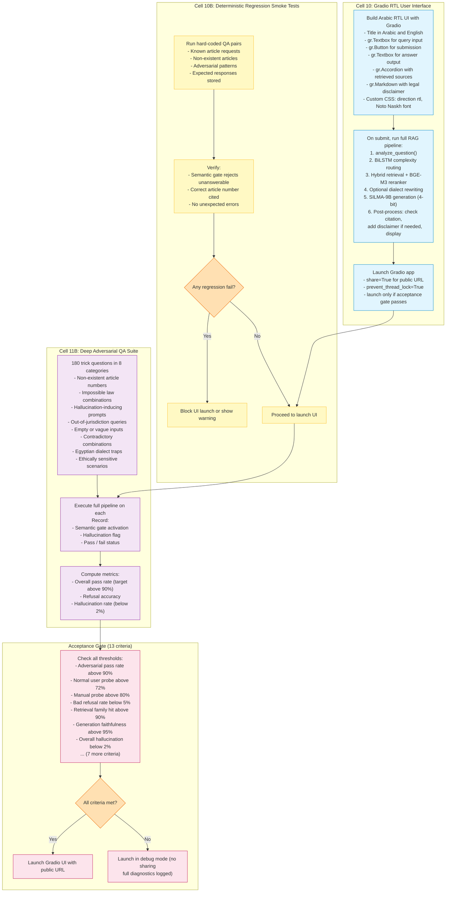

```mermaid
flowchart TD
    %% ============================================================================
    %% CELL 10: Gradio RTL User Interface
    %% ============================================================================
    subgraph cell10["Cell 10: Gradio RTL User Interface"]
        direction TB
        ui_components["Build Arabic RTL UI with Gradio<br/>- Title in Arabic and English<br/>- gr.Textbox for query input<br/>- gr.Button for submission<br/>- gr.Textbox for answer output<br/>- gr.Accordion with retrieved sources<br/>- gr.Markdown with legal disclaimer<br/>- Custom CSS: direction rtl, Noto Naskh font"]
        ui_backend["On submit, run full RAG pipeline:<br/>1. analyze_question()<br/>2. BiLSTM complexity routing<br/>3. Hybrid retrieval + BGE-M3 reranker<br/>4. Optional dialect rewriting<br/>5. SILMA-9B generation (4-bit)<br/>6. Post-process: check citation,<br/>   add disclaimer if needed, display"]
        ui_launch["Launch Gradio app<br/>- share=True for public URL<br/>- prevent_thread_lock=True<br/>- launch only if acceptance gate passes"]
        
        ui_components --> ui_backend --> ui_launch
    end

    %% ============================================================================
    %% CELL 10B: Smoke Tests (Regression Checks)
    %% ============================================================================
    subgraph cell10b["Cell 10B: Deterministic Regression Smoke Tests"]
        direction TB
        smoke_tests["Run hard‑coded QA pairs<br/>- Known article requests<br/>- Non‑existent articles<br/>- Adversarial patterns<br/>- Expected responses stored"]
        smoke_checks["Verify:<br/>- Semantic gate rejects unanswerable<br/>- Correct article number cited<br/>- No unexpected errors"]
        smoke_outcome{"Any regression fail?"}
        smoke_block["Block UI launch or show warning"]
        smoke_proceed["Proceed to launch UI"]
        
        smoke_tests --> smoke_checks --> smoke_outcome
        smoke_outcome -- Yes --> smoke_block
        smoke_outcome -- No --> smoke_proceed
    end

    %% ============================================================================
    %% CELL 11B: Deep Adversarial QA & Acceptance Gates
    %% ============================================================================
    subgraph cell11b["Cell 11B: Deep Adversarial QA Suite"]
        direction TB
        adv_categories["180 trick questions in 8 categories<br/>- Non‑existent article numbers<br/>- Impossible law combinations<br/>- Hallucination‑inducing prompts<br/>- Out‑of‑jurisdiction queries<br/>- Empty or vague inputs<br/>- Contradictory combinations<br/>- Egyptian dialect traps<br/>- Ethically sensitive scenarios"]
        adv_exec["Execute full pipeline on each<br/>Record:<br/>- Semantic gate activation<br/>- Hallucination flag<br/>- Pass / fail status"]
        adv_metrics["Compute metrics:<br/>- Overall pass rate (target above 90%)<br/>- Refusal accuracy<br/>- Hallucination rate (below 2%)"]
        
        adv_categories --> adv_exec --> adv_metrics
    end

    subgraph accept["Acceptance Gate (13 criteria)"]
        direction TB
        criteria["Check all thresholds:<br/>- Adversarial pass rate above 90%<br/>- Normal user probe above 72%<br/>- Manual probe above 80%<br/>- Bad refusal rate below 5%<br/>- Retrieval family hit above 90%<br/>- Generation faithfulness above 95%<br/>- Overall hallucination below 2%<br/>... (7 more criteria)"]
        gate{"All criteria met?"}
        deploy["Launch Gradio UI with public URL"]
        debug["Launch in debug mode (no sharing<br/>full diagnostics logged)"]
        
        criteria --> gate
        gate -- Yes --> deploy
        gate -- No --> debug
    end

    %% ============================================================================
    %% CROSS‑CELL FLOW
    %% ============================================================================
    ui_launch --> smoke_proceed
    smoke_proceed --> adv_exec
    adv_metrics --> criteria

    %% ============================================================================
    %% STYLES
    %% ============================================================================
    classDef ui fill:#e1f5fe,stroke:#0288d1
    classDef test fill:#fff9c4,stroke:#fbc02d
    classDef adversarial fill:#f3e5f5,stroke:#8e24aa
    classDef gate fill:#fce4ec,stroke:#c2185b
    classDef decision fill:#ffe0b2,stroke:#ef6c00

    class ui_components,ui_backend,ui_launch ui
    class smoke_tests,smoke_checks,smoke_block,smoke_proceed test
    class adv_categories,adv_exec,adv_metrics adversarial
    class criteria,deploy,debug gate
    class smoke_outcome,gate decision
```