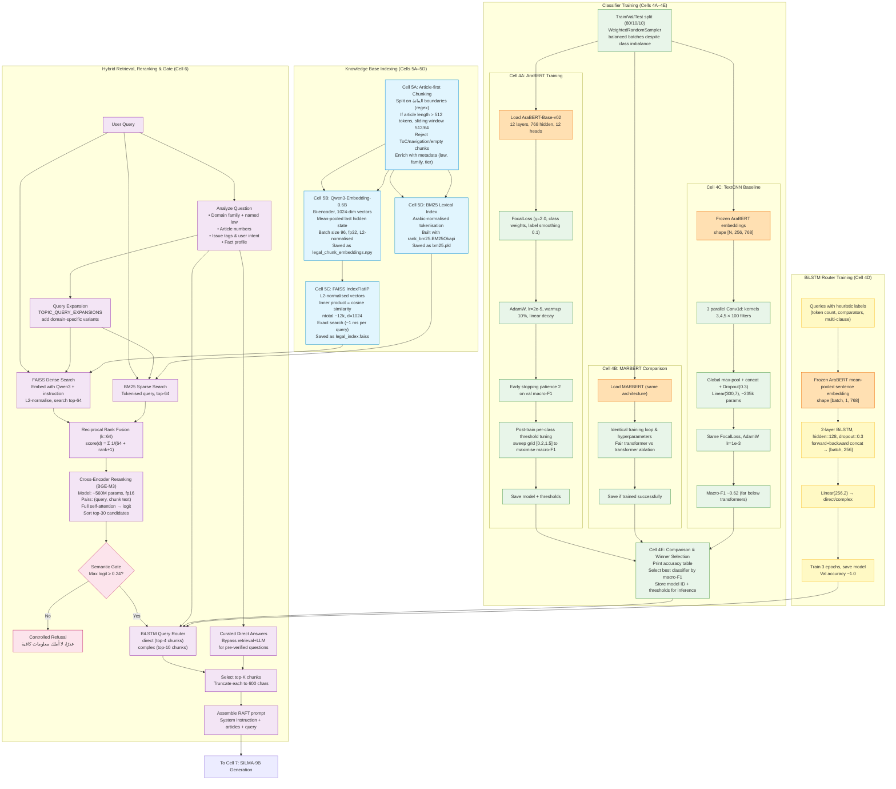

```mermaid
flowchart TD
    %% ============================================================================
    %% PHASE 1: CLASSIFIER TRAINING (Cells 4A–4E)
    %% ============================================================================
    subgraph training["Classifier Training (Cells 4A–4E)"]
        direction TB
        data_split["Train/Val/Test split (80/10/10)<br/>WeightedRandomSampler<br/>balanced batches despite class imbalance"]
        
        subgraph arabert_train["Cell 4A: AraBERT Training"]
            ara_load["Load AraBERT-Base-v02<br/>12 layers, 768 hidden, 12 heads"]
            ara_focal["FocalLoss (γ=2.0, class weights, label smoothing 0.1)"]
            ara_opt["AdamW, lr=2e-5, warmup 10%, linear decay"]
            ara_early["Early stopping patience 2 on val macro-F1"]
            ara_thresh["Post-train per-class threshold tuning<br/>sweep grid [0.2,1.5] to maximise macro-F1"]
            ara_save["Save model + thresholds"]
        end
        
        subgraph marbert_train["Cell 4B: MARBERT Comparison"]
            mar_load["Load MARBERT (same architecture)"]
            mar_loop["Identical training loop & hyperparameters<br/>Fair transformer vs transformer ablation"]
            mar_save["Save if trained successfully"]
        end
        
        subgraph textcnn_train["Cell 4C: TextCNN Baseline"]
            tcnn_embed["Frozen AraBERT embeddings<br/>shape [N, 256, 768]"]
            tcnn_conv["3 parallel Conv1d: kernels 3,4,5 × 100 filters"]
            tcnn_pool["Global max-pool + concat + Dropout(0.3)<br/>Linear(300,7), ~235k params"]
            tcnn_loss["Same FocalLoss, AdamW lr=1e-3"]
            tcnn_result["Macro-F1 ~0.62 (far below transformers)"]
        end
        
        cell4e["Cell 4E: Comparison & Winner Selection<br/>Print accuracy table<br/>Select best classifier by macro-F1<br/>Store model ID + thresholds for inference"]
        
        data_split --> ara_load --> ara_focal --> ara_opt --> ara_early --> ara_thresh --> ara_save
        data_split --> mar_load --> mar_loop --> mar_save
        data_split --> tcnn_embed --> tcnn_conv --> tcnn_pool --> tcnn_loss --> tcnn_result
        ara_save --> cell4e
        mar_save --> cell4e
        tcnn_result --> cell4e
    end

    subgraph router_train["BiLSTM Router Training (Cell 4D)"]
        router_data["Queries with heuristic labels<br/>(token count, comparators, multi-clause)"]
        router_embed["Frozen AraBERT mean-pooled sentence embedding<br/>shape [batch, 1, 768]"]
        router_lstm["2-layer BiLSTM, hidden=128, dropout=0.3<br/>forward+backward concat → [batch, 256]"]
        router_head["Linear(256,2) → direct/complex"]
        router_save["Train 3 epochs, save model<br/>Val accuracy ~1.0"]
        
        router_data --> router_embed --> router_lstm --> router_head --> router_save
    end

    %% ============================================================================
    %% PHASE 2: KNOWLEDGE BASE INDEXING (Cells 5A–5D)
    %% ============================================================================
    subgraph indexing["Knowledge Base Indexing (Cells 5A–5D)"]
        direction TB
        chunk["Cell 5A: Article-first Chunking<br/>Split on المادة boundaries (regex)<br/>If article length > 512 tokens, sliding window 512/64<br/>Reject ToC/navigation/empty chunks<br/>Enrich with metadata (law, family, tier)"]
        embed["Cell 5B: Qwen3-Embedding-0.6B<br/>Bi-encoder, 1024-dim vectors<br/>Mean-pooled last hidden state<br/>Batch size 96, fp32, L2-normalised<br/>Saved as legal_chunk_embeddings.npy"]
        faiss["Cell 5C: FAISS IndexFlatIP<br/>L2-normalised vectors<br/>Inner product = cosine similarity<br/>ntotal ~12k, d=1024<br/>Exact search (~1 ms per query)<br/>Saved as legal_index.faiss"]
        bm25["Cell 5D: BM25 Lexical Index<br/>Arabic-normalised tokenisation<br/>Built with rank_bm25.BM25Okapi<br/>Saved as bm25.pkl"]
        
        chunk --> embed --> faiss
        chunk --> bm25
    end

    %% ============================================================================
    %% PHASE 3: HYBRID RETRIEVAL & GATING (Cell 6)
    %% ============================================================================
    subgraph retrieval["Hybrid Retrieval, Reranking & Gate (Cell 6)"]
        direction TB
        query["User Query"]
        analysis["Analyze Question<br/>• Domain family + named law<br/>• Article numbers<br/>• Issue tags & user intent<br/>• Fact profile"]
        expansion["Query Expansion<br/>TOPIC_QUERY_EXPANSIONS<br/>add domain-specific variants"]
        
        faiss_search["FAISS Dense Search<br/>Embed with Qwen3 + instruction<br/>L2-normalise, search top-64"]
        bm25_search["BM25 Sparse Search<br/>Tokenised query, top-64"]
        
        rrf["Reciprocal Rank Fusion (k=64)<br/>score(d) = Σ 1/(64 + rank+1)"]
        
        rerank["Cross-Encoder Reranking (BGE-M3)<br/>Model: ~560M params, fp16<br/>Pairs: (query, chunk text)<br/>Full self-attention → logit<br/>Sort top-30 candidates"]
        
        gate{"Semantic Gate<br/>Max logit ≥ 0.24?"}
        refuse["Controlled Refusal<br/>عذرًا، لا أملك معلومات كافية"]
        
        router["BiLSTM Query Router<br/>direct (top-4 chunks)<br/>complex (top-10 chunks)"]
        curated["Curated Direct Answers<br/>Bypass retrieval+LLM<br/>for pre-verified questions"]
        
        final_k["Select top-K chunks<br/>Truncate each to 600 chars"]
        prompt["Assemble RAFT prompt<br/>System instruction + articles + query"]
        
        query --> analysis --> expansion
        query --> faiss_search
        query --> bm25_search
        expansion --> faiss_search
        expansion --> bm25_search
        faiss --> faiss_search
        bm25 --> bm25_search
        faiss_search --> rrf
        bm25_search --> rrf
        rrf --> rerank --> gate
        gate -- No --> refuse
        gate -- Yes --> router
        analysis --> router
        router --> final_k
        analysis --> curated
        curated --> final_k
        final_k --> prompt
    end

    %% ============================================================================
    %% GLOBAL FLOW
    %% ============================================================================
    cell4e --> router
    router_save --> router
    chunk --> embed
    chunk --> bm25
    prompt --> gen["To Cell 7: SILMA-9B Generation"]

    %% ============================================================================
    %% STYLES
    %% ============================================================================
    classDef train fill:#e8f5e9,stroke:#388e3c
    classDef routerStyle fill:#fff9c4,stroke:#fbc02d
    classDef index fill:#e1f5fe,stroke:#0288d1
    classDef retrieval fill:#f3e5f5,stroke:#8e24aa
    classDef gateStyle fill:#fce4ec,stroke:#c2185b
    classDef model fill:#ffe0b2,stroke:#ef6c00

    class data_split,ara_load,ara_focal,ara_opt,ara_early,ara_thresh,ara_save,mar_load,mar_loop,mar_save,tcnn_embed,tcnn_conv,tcnn_pool,tcnn_loss,tcnn_result,cell4e train
    class router_data,router_embed,router_lstm,router_head,router_save routerStyle
    class chunk,embed,faiss,bm25 index
    class query,analysis,expansion,faiss_search,bm25_search,rrf,rerank,router,curated,final_k,prompt retrieval
    class gate,refuse gateStyle
    class ara_load,mar_load,tcnn_embed,router_embed model
```