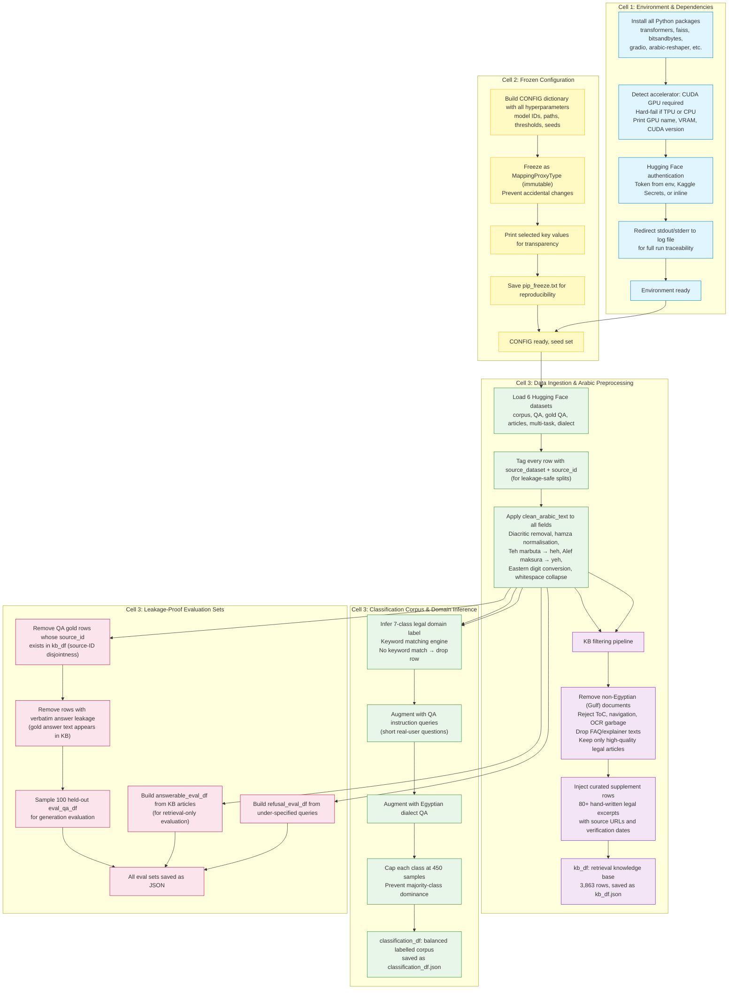

```mermaid
flowchart TD
    %% Cell 1: Environment & Dependencies
    subgraph cell1["Cell 1: Environment & Dependencies"]
        direction LR
        install["Install all Python packages<br/>transformers, faiss, bitsandbytes,<br/>gradio, arabic-reshaper, etc."]
        gpu_detect["Detect accelerator: CUDA GPU required<br/>Hard-fail if TPU or CPU<br/>Print GPU name, VRAM, CUDA version"]
        hf_auth["Hugging Face authentication<br/>Token from env, Kaggle Secrets, or inline"]
        redirect["Redirect stdout/stderr to log file<br/>for full run traceability"]
        install --> gpu_detect --> hf_auth --> redirect --> ready["Environment ready"]
    end

    %% Cell 2: Frozen CONFIG
    subgraph cell2["Cell 2: Frozen Configuration"]
        direction TB
        config_build["Build CONFIG dictionary with all hyperparameters<br/>model IDs, paths, thresholds, seeds"]
        freeze["Freeze as MappingProxyType (immutable)<br/>Prevent accidental changes"]
        print_config["Print selected key values for transparency"]
        save_freeze["Save pip_freeze.txt for reproducibility"]
        config_build --> freeze --> print_config --> save_freeze --> cfg_ready["CONFIG ready, seed set"]
    end

    %% Cell 3: Data Loading & Arabic Preprocessing
    subgraph cell3["Cell 3: Data Ingestion & Arabic Preprocessing"]
        direction TB
        load["Load 6 Hugging Face datasets<br/>corpus, QA, gold QA, articles, multi-task, dialect"]
        tag["Tag every row with source_dataset + source_id<br/>(for leakage-safe splits)"]
        clean["Apply clean_arabic_text to all fields<br/>Diacritic removal, hamza normalisation,<br/>Teh marbuta → heh, Alef maksura → yeh,<br/>Eastern digit conversion, whitespace collapse"]
        kb_filter["KB filtering pipeline"]
        kb_filter_detail["Remove non-Egyptian (Gulf) documents<br/>Reject ToC, navigation, OCR garbage<br/>Drop FAQ/explainer texts<br/>Keep only high-quality legal articles"]
        curated["Inject curated supplement rows<br/>80+ hand-written legal excerpts<br/>with source URLs and verification dates"]
        kb_out["kb_df: retrieval knowledge base<br/>3,863 rows, saved as kb_df.json"]
        
        load --> tag --> clean --> kb_filter --> kb_filter_detail --> curated --> kb_out
    end

    subgraph cell3_clf["Cell 3: Classification Corpus & Domain Inference"]
        direction TB
        infer_label["Infer 7-class legal domain label<br/>Keyword matching engine<br/>No keyword match → drop row"]
        aug_q["Augment with QA instruction queries<br/>(short real-user questions)"]
        aug_dial["Augment with Egyptian dialect QA"]
        cap["Cap each class at 450 samples<br/>Prevent majority-class dominance"]
        clf_out["classification_df: balanced labelled corpus<br/>saved as classification_df.json"]
        
        clean --> infer_label --> aug_q --> aug_dial --> cap --> clf_out
    end

    subgraph cell3_eval["Cell 3: Leakage-Proof Evaluation Sets"]
        direction TB
        disjoint["Remove QA gold rows whose source_id<br/>exists in kb_df (source-ID disjointness)"]
        leak_check["Remove rows with verbatim answer leakage<br/>(gold answer text appears in KB)"]
        sample_eval["Sample 100 held-out eval_qa_df<br/>for generation evaluation"]
        answerable["Build answerable_eval_df from KB articles<br/>(for retrieval-only evaluation)"]
        refusal["Build refusal_eval_df from under-specified queries"]
        eval_out["All eval sets saved as JSON"]
        
        clean --> disjoint --> leak_check --> sample_eval --> eval_out
        clean --> answerable --> eval_out
        clean --> refusal --> eval_out
    end

    %% Connections between phases
    ready --> cfg_ready
    cfg_ready --> load
    clean --> kb_filter
    clean --> infer_label

    %% Styles
    classDef env fill:#e1f5fe,stroke:#0288d1
    classDef config fill:#fff9c4,stroke:#fbc02d
    classDef data fill:#e8f5e9,stroke:#388e3c
    classDef kb fill:#f3e5f5,stroke:#8e24aa
    classDef eval fill:#fce4ec,stroke:#c2185b

    class install,gpu_detect,hf_auth,redirect,ready env
    class config_build,freeze,print_config,save_freeze,cfg_ready config
    class load,tag,clean,infer_label,aug_q,aug_dial,cap,clf_out data
    class kb_filter,kb_filter_detail,curated,kb_out kb
    class disjoint,leak_check,sample_eval,answerable,refusal,eval_out eval
```