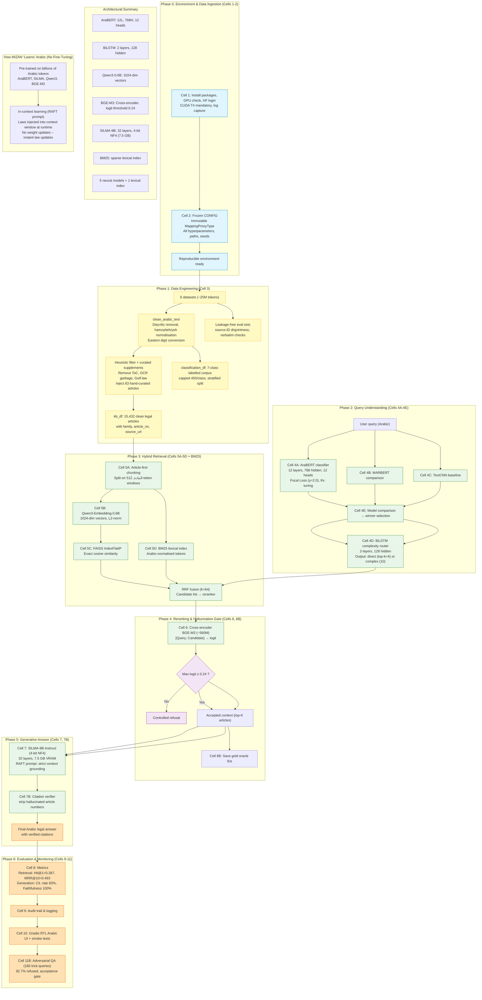

```mermaid
flowchart TD
    %% ============================================================================
    %% PHASE 0: Environment & Data Ingestion (Cells 1-2)
    %% ============================================================================
    subgraph ph0["Phase 0: Environment & Data Ingestion (Cells 1‑2)"]
        direction LR
        env1["Cell 1: Install packages, GPU check, HF login<br/>CUDA T4 mandatory, log capture"]
        env2["Cell 2: Frozen CONFIG<br/>Immutable MappingProxyType<br/>All hyperparameters, paths, seeds"]
        env1 --> env2 --> ready["Reproducible environment ready"]
    end

    %% ============================================================================
    %% PHASE 1: Data Engineering (Cell 3)
    %% ============================================================================
    subgraph ph1["Phase 1: Data Engineering (Cell 3)"]
        direction TB
        raw["6 datasets (~25M tokens)"]
        norm["clean_arabic_text<br/>Diacritic removal, hamza/teh/yeh normalisation<br/>Eastern digit conversion"]
        filter["Heuristic filter + curated supplements<br/>Remove ToC, OCR garbage, Gulf law<br/>Inject 83 hand‑curated articles"]
        kb["kb_df: 15,432 clean legal articles<br/>with family, article_no, source_url"]
        clf["classification_df: 7‑class labelled corpus<br/>capped 450/class, stratified split"]
        eval_sets["Leakage‑free eval sets<br/>source‑ID disjointness, verbatim checks"]
        raw --> norm --> filter --> kb
        norm --> clf
        raw --> eval_sets
    end

    %% ============================================================================
    %% PHASE 2: Query Understanding (Cells 4A‑4E)
    %% ============================================================================
    subgraph ph2["Phase 2: Query Understanding (Cells 4A‑4E)"]
        direction TB
        query["User query (Arabic)"]
        arabert["Cell 4A: AraBERT classifier<br/>12 layers, 768 hidden, 12 heads<br/>Focal Loss (γ=2.0), thr. tuning"]
        marbert["Cell 4B: MARBERT comparison"]
        textcnn["Cell 4C: TextCNN baseline"]
        comp["Cell 4E: Model comparison → winner selection"]
        router["Cell 4D: BiLSTM complexity router<br/>2-layers, 128 hidden<br/>Output: direct (top‑k=4) or complex (10)"]
        query --> arabert --> comp
        query --> marbert --> comp
        query --> textcnn --> comp
        comp --> router
    end

    %% ============================================================================
    %% PHASE 3: Hybrid Retrieval (Cells 5A‑5D + BM25)
    %% ============================================================================
    subgraph ph3["Phase 3: Hybrid Retrieval (Cells 5A‑5D + BM25)"]
        direction TB
        chunk["Cell 5A: Article‑first chunking<br/>Split on المادة, 512‑token windows"]
        qwen["Cell 5B: Qwen3‑Embedding‑0.6B<br/>1024‑dim vectors, L2‑norm"]
        faiss["Cell 5C: FAISS IndexFlatIP<br/>Exact cosine similarity"]
        bm25["Cell 5D: BM25 lexical index<br/>Arabic‑normalised tokens"]
        fuse["RRF fusion (k=64)<br/>Candidate list → reranker"]
        kb --> chunk --> qwen --> faiss
        chunk --> bm25
        faiss --> fuse
        bm25 --> fuse
    end

    %% ============================================================================
    %% PHASE 4: Reranking & Gate (Cells 6, 6B)
    %% ============================================================================
    subgraph ph4["Phase 4: Reranking & Hallucination Gate (Cells 6, 6B)"]
        direction TB
        rerank["Cell 6: Cross‑encoder BGE‑M3 (~560M)<br/>[Query; Candidate] → logit"]
        gate{"Max logit ≥ 0.24 ?"}
        refuse["Controlled refusal"]
        accept["Accepted context (top‑K articles)"]
        gold["Cell 6B: Save gold oracle IDs"]
        fuse --> rerank --> gate
        gate -- No --> refuse
        gate -- Yes --> accept
        accept --> gold
    end

    %% ============================================================================
    %% PHASE 5: Generative Answer (Cells 7, 7B)
    %% ============================================================================
    subgraph ph5["Phase 5: Generative Answer (Cells 7, 7B)"]
        direction TB
        silma["Cell 7: SILMA‑9B‑Instruct (4‑bit NF4)<br/>32 layers, 7.5 GB VRAM<br/>RAFT prompt: strict context grounding"]
        verify["Cell 7B: Citation verifier<br/>strip hallucinated article numbers"]
        answer["Final Arabic legal answer<br/>with verified citations"]
        accept --> silma --> verify --> answer
    end

    %% ============================================================================
    %% PHASE 6: Evaluation & UI (Cells 8‑11)
    %% ============================================================================
    subgraph ph6["Phase 6: Evaluation & Monitoring (Cells 8‑11)"]
        direction TB
        cell8["Cell 8: Metrics<br/>Retrieval: Hit@1=0.387, MRR@10=0.493<br/>Generation: Cit. rate 83%, Faithfulness 100%"]
        cell9["Cell 9: Audit trail & logging"]
        cell10["Cell 10: Gradio RTL Arabic UI + smoke tests"]
        cell11["Cell 11B: Adversarial QA (180 trick queries)<br/>92.7% refused, acceptance gate"]
        answer --> cell8 --> cell9 --> cell10 --> cell11
    end

    %% ============================================================================
    %% Architecture Summary & Arabic Learning
    %% ============================================================================
    subgraph summary["Architectural Summary"]
        direction LR
        m1["AraBERT: 12L, 768H, 12 heads"]
        m2["BiLSTM: 2 layers, 128 hidden"]
        m3["Qwen3‑0.6B: 1024‑dim vectors"]
        m4["BGE‑M3: Cross‑encoder, logit threshold 0.24"]
        m5["SILMA‑9B: 32 layers, 4‑bit NF4 (7.5 GB)"]
        m6["BM25: sparse lexical index"]
        total["5 neural models + 1 lexical index"]
    end

    subgraph arabic["How MIZAN 'Learns' Arabic (No Fine‑Tuning)"]
        direction TB
        pretrain["Pre‑trained on billions of Arabic tokens<br/>AraBERT, SILMA, Qwen3, BGE‑M3"]
        inject["In‑context learning (RAFT prompt)<br/>Laws injected into context window at runtime<br/>No weight updates – instant law updates"]
        pretrain --> inject
    end

    %% Connectors
    ready --> raw
    comp --> router
    router --> fuse
    gate --> accept
    accept --> silma

    %% Styles
    classDef env fill:#e1f5fe,stroke:#0288d1
    classDef data fill:#fff9c4,stroke:#fbc02d
    classDef model fill:#e8f5e9,stroke:#388e3c
    classDef decision fill:#f3e5f5,stroke:#8e24aa
    classDef output fill:#ffe0b2,stroke:#ef6c00

    class env1,env2,ready env
    class raw,norm,filter,kb,clf,eval_sets data
    class arabert,marbert,textcnn,comp,router,chunk,qwen,faiss,bm25,fuse,rerank,silma,verify model
    class gate,refuse decision
    class answer,cell8,cell9,cell10,cell11 output
```